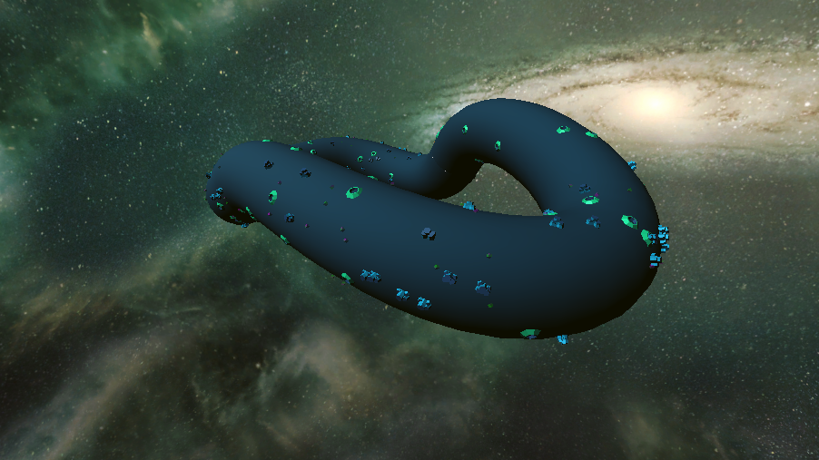

# 🚀 F-Six

F-Six is an arcade racer inspired by games such as F-Zero GX, Wipeout and Mario Kart. The game is set in outer space and alien worlds where players utilize specialized hovercrafts to maneuver the foreign terrain and combat enemies. The game features networked online multiplayer, AI controlled racers, vehicular combat, distinct movement mechanics, procedural generation and more.

## 🚩 Getting Started

- [Unity 2020.3.25f1](https://unity3d.com/get-unity/download)
- [Matchmaking Server](https://github.com/f6-476/server) (Optional)

## 🧩 Features

- Hovering
- Power Ups (Boost, Shield, and Missiles)
- [Unity Netcode](https://unity.com/products/netcode) Networking
- Third-Party Integration ([Discord](https://discord.com/) and [Twitch](https://www.twitch.tv/))
- Maps (Rusty Giant, Loopty Loop, and Under Construction)
- Customization (Ships)
- Cutscenes
- [ML-Agents](https://github.com/Unity-Technologies/ml-agents) AIs
- Steering AIs
- and many more ...

## 🤔 What's New?

The team implemented better collision avoidance between ships, following more the initial proposal. We also improved the power up usage to for AIs to be more responsive to their environment. Additional quality of life changes were done to offer the best final product we could make!

## 📷 Screenshots

## 👥 Team

Ian Lopez (27296126), Alexandre Lavoie (40129457), Zahra Nikbakht (40138253), George Mavroeidis (40065356), Elijah Mon (40078229), Antoine Paulin-Bessette (40098918).

## 📜 License

This game contains copyrighten music and artwork. All rights goes to the authors of these works. All non-licensed works created by the team are under the MIT license.
